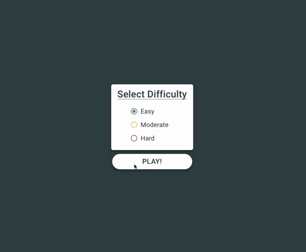

# Memory

###### The classic one-player card game known to most as "Memory"

[Live Link!](https://memory-6fc80b.netlify.app)

### How To Play

Select a difficulty and press play! Easy has 12 cards, Moderate has 24, and Hard has 40.

Simply click on a card to flip it over. If you make a match with your second flipped card, both cards will remain turned over and the progress indicator at the top will fill. If the second flipped card is not a match, both cards will turn back over after a 1-second delay.

When you make the final match of the game, you will be prompted to play again. You can change the difficulty or keep it the same. Cards are always randomly sorted at the start of the game, so if you do keep the same difficulty, the cards will be in a different location.

